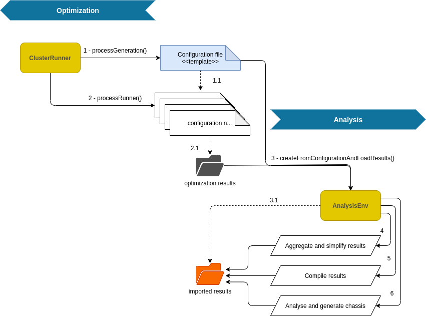

# Yeast Chassis Design

## 1 - Introduction

This code is part of the work *Model-guided development of an evolutionarily stable yeast chassis* submitted to MSB.

The code is composed by an Analysis environment that is executed over the results of a previous computational strain optimization process. The code for the optimization part is not included in this repository but it is freely available and explained in the sections below.

The Analysis Environment is located in the source folder `src/main/java/com.silicolife.yeastchassis.env.AnalysisEnv`.

An example of its use is located in the tests folder `src/test/java/com.silicolife.yeastchassis.analysis.Analyze_20210323_acids` - this example generates the results used in the case study described in the paper.


## 2 - Workflow

The overall workflow of optimization + analysis can be seen in Figure 1.

*Figure 1: Workflow of optimization + analysis.*

* **Optimization stage** - Before having results, it is required to run optimization procedures in order to generate them. This is done by **1)** feeding a template configuration to the cluster runner and specifying how many repetitions (runs) are wanted for each state (see explanation of the configuration file below). Afterwards, in **2)** the optimizations are executed (locally or in a cluster environment), generating optimization results (**2.1**) in the previously generated directory structure. 

* **Analysis stage** - After the optimization results are available, enters the analysis stage. Here, **3)** a new `AnalysisEnv` is created by feeding the template configuration file and the location of the results folder. This will yield a new directory structure (**3.1**) with the imported results. Next **4)**, it is required to simplify and aggregate the results, removing repeated solutions and cleaning the solutions from unimportant features. Afterwards, in **5)** it is compiled a final list of the results for each state, where several metrics can be calculated. Finally in **6)**, the analysis the overall results is done, finding important gene/reaction frequencies and compiling sets of solutions sharing a common chassis and order them according to a pre-specified score.  

## 3 - The configuration file

It enables configurations for single or multiple optimization procedures to be stored, executed and shared effortlessly. The package is composed of several hierarchically related classes where, at the top of the hierarchy, is the SmartProperties utility class (mewcore/utils).

Any configuration sub-class, whether it is a ModelConfiguration, a SimulationConfiguration, an OptimizationConfiguration or a ClusterConfiguration, is an extension of this class, thus inheriting all of its properties and features, which include:

* **Order awareness**: - The class is fully aware of the ordering of the properties therein contained, either by their in-memory declaration time or by their position in the configuration file;
* **Self awareness**: - A configuration can refer to itself or to its current directory using the reserved special variables `${THIS}` and `${CDIR}`, respectively.
* **Properties inheritance**: - A configuration instance can inherit from another configuration instance, by using the special modifier `@DEPENDS`;
* **Variable declaration**: - User defined variables can be declared by using the special modifier `$` followed by the desired variable name. Declared variables can be later accessed by using the modifier `${<VAR>}`. All the system variables are also made available via the same modifier (`$`). Multiple values can be assigned to a variable by separating them
with the delimiter `|`.
* **Aliases declaration**: - User defined aliases can be attributed to variables’ assignments via the special modifier `~`. This is useful for referring to long or unorthodox variables’ assignments.
* **Multiple states**: - Using the special modifier `@COMBINE`, variables can be combined.

A configuration can be declared to combine some or all of its variables, thus possibly generating multiple states. This happens when a variable possesses multiple assignments and is combined with other variables. A configuration will have as many states as the number of possible unique combinations generated by the multiply-assigned variables combined with the @COMBINE modifier. 

An example configuration file and respective multi-state tree, representing a workflow is represented in Figure 2 where 5 variables are combined. In this example, the ENV COND (environmental conditions) variable has 2 assignments - aerobic and anaerobic; the SUB (substrate) variable has 3 assignments - glucose, xylose and glycerol; the PROD (target product) variable has 5 assignments - succinate, lactate, pyruvate, glycerol and phenylalanine; the SIM (simulation method) variable has 2 assignments - PFBA and LMOMA; and the OPT ALG (optimization algorithm) variable has 3 assignments - EA, SA and SPEA2. When we combine these 5 variables, a state tree is generated where each state is represented by a path from the root to each of the leafs. In this case, a total of 180 states/paths (2 ⇥ 3 ⇥ 5 ⇥ 2 ⇥ 3) are generated, each representing a unique combination of each of the 5 variables. This facility provides a powerful and flexible tool to generate complex workflows where multiple alternatives can be tested and summarized in a single file.

*Figure 2: Example of a configuration file (a) where 5 variables are combined, some of which have multiple assignments. The tree of possible combinations is displayed in b) with a particular state highlighted (state 1 - dotted purple area).*

## 4 - Optimization

Optimizations were executed in a ROCKS cluster with the PBS queuing system installed (qsub, qstat, etc.), as such, the optimization configuration files are specific for that case, however, individual optimizations can still be executed by using the same configuration file.

Each optimization set (a set of many optimization procedures) is stored inside a `root_folder` with the following directory structure (the one used for this work is available under `data/20170313_acids_GK_IMPORT`):

**root_folder**
* **conditions** - where files specifying environmental conditions are stored
* **configuration** - where the configuration files are stored
* **env** - a folder where serialization of the optimization/analysis environment can be stored 
* **model** - folder with models and/or model related files
* **targets** - folder with non-targets (critical genes, reactions, etc.) - these are specific for the strategy, env. conditions used, etc.

To execute optimizations using this directory structure, the users need to clone the Git repositories [mewcore](https://github.com/MEWorkbench/mewcore) and [mewcore.cmd](https://github.com/MEWorkbench/mewcore.cmd). The dependencies are available in the [MEWorkbench organization](https://github.com/MEWorkbench) and at the [JeCoLi repository](https://github.com/jecoli/jecoli) also at GitHub. Similarly, these dependencies are also available as maven dependencies at the [MVNrepository](https://mvnrepository.com/artifact/pt.uminho.ceb.biosystems).

After cloning these repositories, the user has multiple options, either run a single optimization based on a configuration file, or generate a structure of directories with multiple configurations to be executed in a cluster environment. The idea is that the configuration file (located inside the configuration folder) works as a template for a multitude of possible configurations. 

### 4.1 - Generate run configurations from a template configuration file

The following example will generate the directory structure for all the states contained within the template configuration file, for as many runs (`num_runs`) as you specify. For each run in each state, an individual run script and individual configuration file will be created. It will also create a master bash script that allows launching all of the jobs in a cluster environment as long as the PBS system is used for queue management.

```java
ClusterRunner.processGeneration(String path_to_configuration_file, int num_runs);
```

### 4.2  -Run an individual configuration file

The following example allows running an individual configuration file (an individual optimization procedure) in your local machine

```java
ClusterRunner.processRunner(String path_to_configuration_file);
```

## 5 - Analysis

The Analysis environment is a processor that takes the configuration file used for optimization as a parameter and creates an internal tree of states based on that configuration. Furthermore, it can also load the results generated by those optimizations and generate a new directory structure with everything prepared for further analysis.

We will use the example from the paper which is locate in the test file `/yeastchassis/src/test/java/com/silicolife/yeastchassis/analysis/Analyze_20210323_acids`. The test file includes detailed explanations about each step of the analysis procedure and information about possible parameters to set.

Inside this test file, each `@Test` refers to one of the analysis steps. It makes more sense to only have one of the tests active at each time, given that they will execute in arbitrary order otherwise. In the test file, most test methods are commented (`//@Test`) to prevent them from executing. Please note, that users can create new files and use this code as they see fit.

### 5.1 - Importing results and creating analysis environment multi-state tree

The first time that users are importing the optimization results, it is required to use:

```java
//@Test
public void importAndSaveEnv() throws Exception {		
AnalysisEnv env = new AnalysisEnv();
env.createFromConfigurationAndLoadResults(baseDir+"/configuration/20170313_iMM904_aerobic_IMPORT_current.conf", baseDirTargets, baseDir);
env.saveSerializedObject(envSerialized);
}
```
* This will generate the new directory structure inside the root (in this case, it is already created in `/yeastchassis/data/20170313_acids_GK_IMPORT/20170313_1609#[EXT_IMPORT]`).
* In the last line, we are serializing the environment for further use.
* *note:* the @Test is commented to prevent it from running

Users can then use than pass that environment as a parameter for use in multitude of Tasks.

### 5.2 - Aggregation and simplification

The typical analysis process begins with aggregating and simplifying the results according to some parameters.
First, users are required to load the environment that was previous serialized.

```java
AnalysisEnv env = AnalysisEnv.loadSerializedObject(envSerialized);
env.printTree();
```

Afterwards, users can specify one or more objective functions that will be used to
evaluate the solutions for simplification purposes. For each objective function, it 
is also possible to specify the percentage of "fitness" that can be lost in that objective function
when simplifying the solution
		
```java
Map<Map<String,Object>,String> overrideObjectiveFunctions = new HashMap<>();
Map<String,Object> cyield_configuration = new HashMap<>();
cyield_configuration.put(CYIELDObjectiveFunction.OBJECTIVE_FUNCTION_ID, CYIELDObjectiveFunction.ID);		
overrideObjectiveFunctionConfiguration.put(cyield_configuration,"FBA"); //carbon yield will be calculated based on the results of the FBA simulation

Map<String,Object> simplifierOptions = new HashMap<>();
simplifierOptions.put(SimplifierOptions.MIN_PERCENT_PER_OBJFUNC, new Double[]{0.9});
```

Finally, the `AggregateSimplifyTask` is created, specifying the root directory of the results (the directory generated in the first analysis step - `createFromConfigurationAndLoadResults()`.
The simplification process can take a long time

```java
AggregateSimplifyTask aggregateSimplify = new AggregateSimplifyTask(baseDir+"/20170313_1609#[EXT_IMPORT]", env, false);
aggregateSimplify.setOverrideObjectiveFunctionsConfiguration(overrideObjectiveFunctionConfiguration);
aggregateSimplify.setSimplifierOptions(simplifierOptions);
aggregateSimplify.run();
```

### 5.3 - Compile results

When the results have been aggregated and simplified, it is now possible to generate a final compilation of the solutions, with multiple metrics calculated. 

The first step is, as before, loading the analysis environment:

```java
AnalysisEnv env = AnalysisEnv.loadSerializedObject(envSerialized);
env.printTree();
```

Afterwards, it is possible to specify multiple simulation methods (FBA, pFBA, MOMA, lMOMA, etc.)...

```java
Map<String,Map<String,Object>> overrideSimulationConfiguration = new HashMap<String,Map<String,Object>>();

Map<String,Object> fbaConf = new HashMap<>();
fbaConf.put(SimulationProperties.METHOD_ID, SimulationProperties.PFBA);
fbaConf.put(SimulationProperties.IS_MAXIMIZATION, true);
fbaConf.put(SimulationProperties.SOLVER, CPLEX3SolverBuilder.ID);
fbaConf.put(SimulationProperties.OBJECTIVE_FUNCTION, null);
fbaConf.put(SimulationProperties.MODEL, null);
fbaConf.put(SimulationProperties.ENVIRONMENTAL_CONDITIONS, null);
overrideSimulationConfiguration.put(SimulationProperties.PFBA, fbaConf);
```

as well as multiple objective functions to be calculated for each solution.
For each objective function, the user must specify which simulation method should be user to calculate it.

```java
Map<Map<String, Object>, String> overrideObjectiveFunctions = new LinkedHashMap<>();

/**
 * 0 - number of knockouts
 */
Map<String, Object> nkConf = new HashMap<>();
nkConf.put(NumKnockoutsObjectiveFunction.OBJECTIVE_FUNCTION_ID, NumKnockoutsObjectiveFunction.ID);
nkConf.put(NumKnockoutsObjectiveFunction.NK_PARAM_MAXIMIZATION, false);
ofMapExtra.put(nkConf, SimulationProperties.PFBA);

/**
 * 1 - biomass flux value
 */
Map<String, Object> fvBioConf = new HashMap<>();
fvBioConf.put(FluxValueObjectiveFunction.OBJECTIVE_FUNCTION_ID, FluxValueObjectiveFunction.ID);
fvBioConf.put(FluxValueObjectiveFunction.FV_PARAM_MAXIMIZATION, true);
fvBioConf.put(FluxValueObjectiveFunction.FV_PARAM_REACTION, ObjectiveFunctionParameterType.REACTION_BIOMASS);
ofMapExtra.put(fvBioConf, SimulationProperties.PFBA);
		
/**
 * 2 - target flux value
 */
Map<String, Object> fvProdConf = new HashMap<>();
fvProdConf.put(FluxValueObjectiveFunction.OBJECTIVE_FUNCTION_ID, FluxValueObjectiveFunction.ID);
fvProdConf.put(FluxValueObjectiveFunction.FV_PARAM_MAXIMIZATION, true);
fvProdConf.put(FluxValueObjectiveFunction.FV_PARAM_REACTION, ObjectiveFunctionParameterType.REACTION_PRODUCT);
ofMapExtra.put(fvProdConf, SimulationProperties.PFBA);

(...)
```

Finally, the `CompileResultsTask` is created, specifying, like in the previous step, the root directory of the results (the directory generated in the first analysis step - `createFromConfigurationAndLoadResults()`.
It is possible to specify some preliminary filters, like ignoring solutions if the result from a given objective function is zero.

```java
CompileResultsTask compileTask = new CompileResultsTask(baseDir+"/20170313_1609#[EXT_IMPORT]", env, null);
compileTask.setMapping(AnalysisEnv.OPT_ALGORITHMS);
compileTask.setOverrideIfExistent(true);
compileTask.setIgnoreOFifZero(new int[]{4});
compileTask.setOverrideSimulationConfigurations(overrideSimulationConfiguration);
compileTask.setOverrideObjectiveFunctionsConfiguration(ofMapExtra);
compileTask.run();
```

The execution of this step will, for each target/condition/etc., generate a file where for each solution, multiple columns (one for each objective function (metric) specified will be available. These files are generated per-variable, i.e., by specifying the variable at which the results should be mapped (e.g. if multiple algorithms had been used for each target/condition optimization, users could compile the final set of solutions by merging at the `AnalysisEnv.OPT_ALGORITHMS` variable, which would ignore which algorithm yielded each solution). If no mapping variable is specified, they will be generated at the end of each branch of the state-tree.
These files are mandatory for the final analysis step.

### 5.4 - Analyse and generate chassis

The final step is the analysis of frequent genes and generation of candidate chassis for each target.

Again, it begins by loading the analysis environment:

```java
AnalysisEnv env = AnalysisEnv.loadSerializedObject(envSerialized);
env.printTree();
```

...followed by a specification of the same simulation methods and objective functions as the in the previous step. It should be intuitive that this is not required if the tasks are called within the same method (because the objective function and simulation method maps would be shared by them).

```java
Map<String,Map<String,Object>> overrideSimulationConfiguration = (...)

Map<Map<String, Object>, String> overrideObjectiveFunctions = (...)

```

Finally, `the ChassisTask` is created and executed. 

```java
ChassisTask mostFrequent = new ChassisTask(baseDir+"/20170313_1609#[EXT_IMPORT]", env ,3, 3); 
mostFrequent.setOverrideSimulationConfigurations(overrideSimulationConfiguration);
mostFrequent.setOverrideObjectiveFunctionsConfiguration(overrideObjectiveFunctions);
mostFrequent.setMapping(AnalysisEnv.PRODUCTION_TARGETS); //map the analysis at the PRODUCTION_TARGET variable, i.e., analysis will be centered on the targets 
mostFrequent.setBaseUrl("https://www.yeastgenome.org/locus/"); 				
mostFrequent.setObjectiveFunctionIndexes(new int[] {0, 5, 6}); 				
mostFrequent.setObjectiveFunctionForScoring(5); 								
mostFrequent.considerTopScoreSolutions(0.3); 									
mostFrequent.addFilterAllowSolutions(5, 0.95, true, true); 					
mostFrequent.setStandard2systematic(baseDir + "/model/GIDS.csv", false); 	
mostFrequent.setSaveGeneFrequencyTableAndHeatMap(true); 						
mostFrequent.setMaxSolutionsPerVariable(100000); 								
mostFrequent.setDescription("Original Acids chassis (pFBA)");
mostFrequent.run();
```
Details about each parameter are available in the test class, however, it is important to highlight
some of them:

* First, in the constructor, the last two parameters `... = new ChassisTask("...", env,`**3**`,`**3**`);` specify the minimum and the maximum size of the chassis to generate. The larget the maximum size of the chassis the more complex and the longer it will take to complete (it is combinatorially explosive, thus it may require to be stricter with the filters that are considered, allowing less highly frequent genes to be used for combinations or less solutions to be allowed). 

* Finally, the mapping variable is set to `AnalysisEnv.PRODUCTION_TARGETS` because our analysis variables are the production targets (we are searching for chassis that work well for solutions from multiple targets). In this design case, it does not make sense to use another mapping variable.


